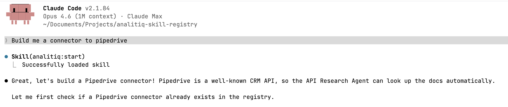

# Xero

[](https://github.com/analitiq-dip-registry)
[](https://github.com/analitiq-dip-registry/xero/releases)
[](LICENSE)

Read accounting data from [Xero](https://www.xero.com), a cloud accounting platform for small and medium businesses, via the Xero Accounting API.

## What is this?

This is a **connector** — a configuration that defines how to authenticate with Xero and what data endpoints are available for reading and writing. It does not move data by itself. Instead, it is used by the [Analitiq](https://analitiq-app.com) data integration platform or the open-source `analitiq-dip-registry` engine to set up data pipelines.

## How to use this connector

There are two ways to use this connector:

### Option 1 — Analitiq Cloud (no setup required)

All connectors from this registry are automatically available on [analitiq-app.com](https://analitiq-app.com). Simply log in, select the connector, and follow the on-screen instructions to connect your account.

### Option 2 — Open Source (self-hosted)

All connectors are open source and free to use. To get started:

1. Clone the [analitiq-dip-registry](https://github.com/analitiq-dip-registry) repository
2. Install the Claude plugin `analitiq-plugin-dataflow`
3. Launch Claude in the root directory of `analitiq-dip-registry`
4. Tell it: *"I need to move data from X to Y"*

The `analitiq-plugin-dataflow` plugin will automatically fetch the required connectors from the [Analitiq DIP Registry](https://github.com/analitiq-dip-registry) and set up the data flow pipeline for you.

## Prerequisites

- A Xero account with access to at least one organisation.

## Authentication

Xero uses **OAuth2 (authorization code grant)**. You authorise the connector in the browser, Xero issues an access token and a refresh token (via the `offline_access` scope), and the connector refreshes the access token automatically as it expires.

Because a single Xero login can have access to multiple organisations ("tenants"), after authorising you select **which organisation** to connect. The connector calls `GET https://api.xero.com/connections`, lists your authorised organisations, and stores the chosen `tenantId`. Every Accounting API request then sends that value in the mandatory `Xero-tenant-id` header.

This connector requests read-only scopes: `accounting.transactions.read`, `accounting.contacts.read`, `accounting.settings.read`, `accounting.journals.read`, `accounting.reports.read`, plus `openid profile email offline_access`.

### How to connect

The OAuth2 app (Client ID and Client Secret) is **managed by the platform** — you do not register your own Xero app or supply any credentials.

1. Click **Connect to Xero** and authorise the app in the browser consent screen.
2. Pick the organisation (tenant) you want to sync.

## Available Endpoints

All endpoints are read-only. Most transactional endpoints support incremental sync via the `If-Modified-Since` header; large collections are paginated.

| Endpoint | Method | Description |
|----------|--------|-------------|
| `accounts` | GET | The full chart of accounts. |
| `bank_transactions` | GET | Spend- and receive-money bank transactions. |
| `contacts` | GET | Customers and suppliers (contacts). |
| `credit_notes` | GET | Credit notes against sales and purchase invoices. |
| `invoices` | GET | Sales (ACCREC) and purchase (ACCPAY) invoices. |
| `items` | GET | Inventory and non-inventory products/services. |
| `journals` | GET | Immutable general-ledger journals. |
| `manual_journals` | GET | Manual journals posted to the general ledger. |
| `organisations` | GET | Organisation settings and metadata for the connected tenant. |
| `payments` | GET | Payments against invoices, credit notes, prepayments and overpayments. |

## Limitations

- **Rate limits** — Xero allows 60 calls per minute and 5,000 calls per day per organisation (tenant), with a concurrency cap. The connector throttles to 60 requests / 60 seconds.
- **Multi-tenant** — each connection targets a single organisation. Connect once per organisation you want to sync.
- **Dates** — Xero serialises timestamps in its `/Date(…)/` format; date/time fields are surfaced as strings.
- **Incremental sync** — `journals` track creation only (immutable), so they replicate on `CreatedDateUTC`; other transactional endpoints replicate on `UpdatedDateUTC`. `accounts`, `items`, `organisations` are full-refresh / settings resources.

## For AI agents

This connector includes `CLAUDE.md` and `AGENTS.md` files — machine-readable references used by AI agents and agentic frameworks. They document authentication types, available endpoints, post-auth steps, and any caveats for programmatic use. Both files are kept identical — `CLAUDE.md` is for Claude Code, `AGENTS.md` is for other agent frameworks.

## Create a connector to any system

You can create a new connector to any API or database using Claude and the Analitiq connector builder plugin:

1. Install [Claude Code](https://claude.ai/code)
2. Install the connector builder plugin:
   ```
   claude plugin add analitiq-dip-registry/analitiq-plugin-connector-builder
   ```
3. Launch Claude and say: *"I want to create a connector for [system name]"*
4. The plugin will interview you about the system, research its API documentation, and generate the full connector with all required files

No coding required — the plugin handles authentication research, endpoint schema generation, and file creation automatically.



## Contributing

All connectors in this registry are community-maintained and live at [github.com/analitiq-dip-registry](https://github.com/analitiq-dip-registry). To add new endpoints or improve an existing connector, install the [connector builder plugin](https://github.com/analitiq-dip-registry/analitiq-plugin-connector-builder) and follow its instructions.

## Links

- [Xero Accounting API Documentation](https://developer.xero.com/documentation/api/accounting/overview)
- [Xero Developer portal](https://developer.xero.com/app/manage)
- [Analitiq Cloud](https://analitiq-app.com)
- [Analitiq Engine (open source)](https://github.com/analitiq-ai/analitiq-engine)
- [Analitiq DIP Registry (open source)](https://github.com/analitiq-dip-registry)
